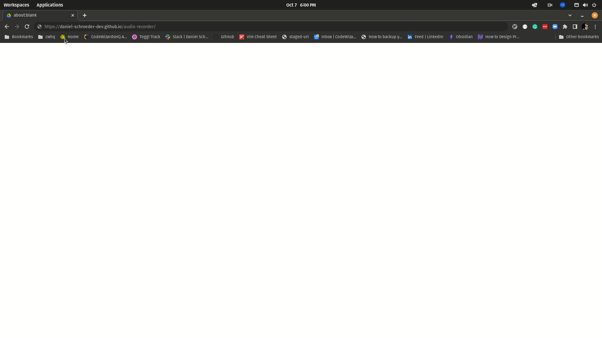

# Audio Recorder

This is a simple web app to record and download audio written for the kids at CWHQ to use in their projects.

## Usage

Make sure to allow audio on the webpage, select your preferred input device, and hit "Record" to begin recording.

Press "Stop" to stop recording and you'll be prompted to save the file locally. 

## Contributing

Pull requests are welcome. For major changes, please open an issue first to discuss what you would like to change.

Please make sure to update tests as appropriate.

## License
[MIT](https://choosealicense.com/licenses/mit/)
